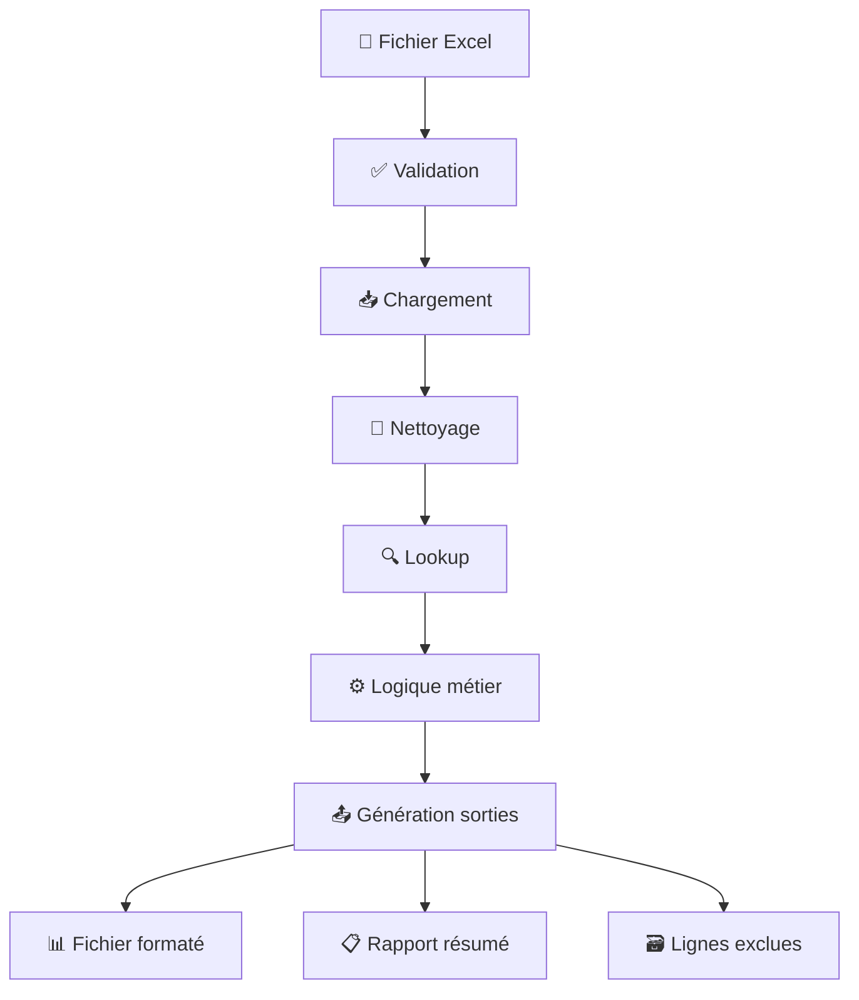

# Component Data Processor - Vue d'ensemble

## 🎯 Objectif

Le Component Data Processor est une solution complète et professionnelle pour automatiser le traitement des données de composants électroniques. Il transforme des fichiers Excel bruts en données nettoyées et mises à jour selon des règles métier spécifiques.

## 🏗️ Architecture organisée

### Structure modulaire

Le code a été organisé selon les meilleures pratiques de développement Python :

```
📦 component-data-processor/
├── 🔧 src/                          # Code source principal
│   ├── 🎯 component_processor/      # Logique métier principale
│   ├── 📊 data_handlers/            # Traitement des données
│   └── 🛠️ utils/                    # Utilitaires réutilisables
├── 🧪 tests/                        # Tests unitaires complets
├── 📚 docs/                         # Documentation technique
├── ⚙️ config/                       # Configurations
├── 📋 examples/                     # Exemples et démos
└── 🚀 main.py                       # Point d'entrée principal
```

### Séparation des responsabilités

#### 🎯 Module principal (`component_processor/`)
- **`processor.py`**: Orchestrateur principal qui coordonne tout le flux
- **`config_manager.py`**: Gestion centralisée de la configuration

#### 📊 Gestionnaires de données (`data_handlers/`)
- **`data_cleaner.py`**: Nettoyage et normalisation des données
- **`lookup_processor.py`**: Logique de lookup et traitement des statuts
- **`excel_handler.py`**: Gestion avancée des fichiers Excel avec formatage

#### 🛠️ Utilitaires (`utils/`)
- **`logger.py`**: Système de logging professionnel
- **`file_manager.py`**: Gestion des fichiers et répertoires
- **`validators.py`**: Validation des données et formats

## 🔄 Flux de traitement amélioré



## 🎨 Fonctionnalités avancées

### 1. Configuration flexible
- **JSON**: Configuration structurée et lisible
- **Variables d'environnement**: Surcharge pour différents environnements
- **Validation**: Vérification automatique de la cohérence

### 2. Logging professionnel
- **Niveaux multiples**: DEBUG, INFO, WARNING, ERROR, CRITICAL
- **Sorties multiples**: Console + fichier avec rotation
- **Métriques**: Suivi des performances et statistiques

### 3. Validation robuste
- **Format de fichiers**: Vérification des types et tailles
- **Structure des données**: Validation des colonnes et types
- **Règles métier**: Validation des numéros de pièces, projets, prix

### 4. Gestion d'erreurs
- **Récupération gracieuse**: Continuation malgré les erreurs
- **Traçabilité**: Logs détaillés pour le débogage
- **Rapports d'exclusion**: Suivi des données problématiques

## 🧪 Tests et qualité

### Tests unitaires complets
```bash
# Exécuter tous les tests
python tests/run_tests.py

# Avec couverture de code
python tests/run_tests.py --coverage

# Test spécifique
python tests/run_tests.py --module test_data_cleaner
```

### Modules testés
- ✅ **DataCleaner**: Nettoyage et normalisation
- ✅ **LookupProcessor**: Logique de lookup et statuts
- ✅ **DataValidator**: Validation des données
- ✅ **ExcelHandler**: Gestion des fichiers Excel
- ✅ **FileManager**: Opérations sur les fichiers

## 🚀 Utilisation simplifiée

### Interface en ligne de commande

```bash
# Aide complète
python main.py --help

# Créer des exemples
python main.py --create-samples

# Traitement simple
python main.py input.xlsx

# Traitement en lot
python main.py --batch "data/*.xlsx"

# Validation seulement
python main.py input.xlsx --validate-only

# Mode verbeux
python main.py input.xlsx --verbose

# Configuration personnalisée
python main.py input.xlsx --config config/prod.json
```

### API programmatique

```python
from src.component_processor.processor import ComponentDataProcessor

# Utilisation simple
processor = ComponentDataProcessor()
success = processor.process_file("input.xlsx")

# Avec configuration
processor = ComponentDataProcessor("config/custom.json")
results = processor.process_multiple_files(["file1.xlsx", "file2.xlsx"])

# Statistiques
stats = processor.get_global_statistics()
print(f"Fichiers traités: {stats['files_processed']}")
```

## 📊 Sorties enrichies

### 1. Fichier Excel formaté
- 🟡 **Jaune**: Composants mis à jour (D→X)
- 🔴 **Rouge**: Doublons/inconnus nécessitant attention
- 🔘 **Gris**: Composants ignorés (status X)
- 💬 **Commentaires**: Notes explicatives dans les cellules

### 2. Rapports détaillés
- **Résumé CSV**: Statistiques complètes du traitement
- **Lignes exclues**: Données problématiques avec raisons
- **Logs structurés**: Traçabilité complète des opérations

### 3. Master BOM mis à jour
- **Sauvegarde automatique**: Backup avant modification
- **Traçabilité**: Historique des changements
- **Validation**: Vérification de l'intégrité

## 🔧 Extensibilité

### Points d'extension
1. **Nouveaux formats**: Ajouter support CSV, JSON, bases de données
2. **Nouvelles règles**: Étendre la logique métier
3. **Nouveaux validateurs**: Ajouter des règles de validation
4. **Nouveaux outputs**: Support PDF, API REST, etc.

### Architecture plugin-ready
```python
# Exemple d'extension
class CustomProcessor(ComponentDataProcessor):
    def custom_validation(self, df):
        # Logique personnalisée
        return df
    
    def custom_output(self, df):
        # Format de sortie personnalisé
        pass
```

## 📚 Documentation complète

### Guides disponibles
- 📖 **README.md**: Guide utilisateur principal
- 🏗️ **ARCHITECTURE.md**: Architecture technique détaillée
- 🔧 **API_REFERENCE.md**: Référence API complète
- 🚀 **DEPLOYMENT.md**: Guide de déploiement production

### Exemples pratiques
- 📋 **Fichiers d'exemple**: Master BOM et données d'entrée
- 🧪 **Tests de validation**: Cas d'usage réels
- ⚙️ **Configurations**: Exemples pour différents environnements

## 🎯 Avantages de la nouvelle organisation

### ✅ Maintenabilité
- Code modulaire et bien structuré
- Séparation claire des responsabilités
- Tests unitaires complets

### ✅ Flexibilité
- Configuration JSON flexible
- Support multi-environnements
- API programmatique

### ✅ Robustesse
- Gestion d'erreurs avancée
- Validation à tous les niveaux
- Logging professionnel

### ✅ Professionnalisme
- Documentation complète
- Tests automatisés
- Déploiement production-ready

## 🚀 Prochaines étapes

1. **Déploiement**: Utiliser les guides de déploiement
2. **Personnalisation**: Adapter la configuration aux besoins
3. **Extension**: Ajouter des fonctionnalités spécifiques
4. **Intégration**: Incorporer dans les workflows existants

---

**Le Component Data Processor est maintenant une solution professionnelle, modulaire et extensible, prête pour un usage en production ! 🎉**
