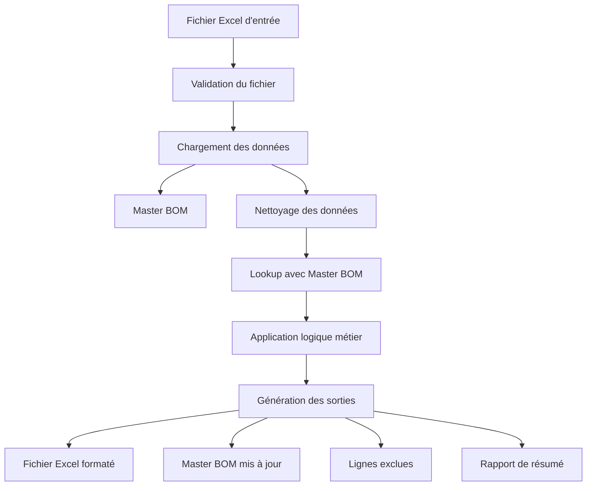

# Architecture du Component Data Processor

## Vue d'ensemble

Le Component Data Processor est une application Python modulaire conçue pour automatiser le traitement et la mise à jour des données de composants basées sur des fichiers Excel. L'architecture suit les principes de séparation des responsabilités et de modularité.

## Structure du projet

```
component-data-processor/
├── src/                          # Code source principal
│   ├── component_processor/      # Module principal
│   │   ├── __init__.py
│   │   ├── processor.py          # Orchestrateur principal
│   │   └── config_manager.py     # Gestionnaire de configuration
│   ├── data_handlers/            # Gestionnaires de données
│   │   ├── __init__.py
│   │   ├── excel_handler.py      # Gestion des fichiers Excel
│   │   ├── data_cleaner.py       # Nettoyage des données
│   │   └── lookup_processor.py   # Traitement des lookups
│   └── utils/                    # Utilitaires
│       ├── __init__.py
│       ├── logger.py             # Système de logging
│       ├── file_manager.py       # Gestion des fichiers
│       └── validators.py         # Validation des données
├── tests/                        # Tests unitaires
├── docs/                         # Documentation
├── examples/                     # Exemples et fichiers de test
├── config/                       # Fichiers de configuration
├── main.py                       # Point d'entrée principal
└── requirements.txt              # Dépendances Python
```

## Modules principaux

### 1. ComponentDataProcessor (`src/component_processor/processor.py`)

**Responsabilité**: Orchestrateur principal qui coordonne l'ensemble du processus.

**Fonctionnalités**:
- Initialisation et configuration
- Coordination des étapes de traitement
- Gestion des erreurs et logging
- Génération des statistiques globales

**Flux de traitement**:
1. Validation du fichier d'entrée
2. Chargement des données (input + Master BOM)
3. Nettoyage des données
4. Traitement du lookup
5. Génération des sorties

### 2. ConfigManager (`src/component_processor/config_manager.py`)

**Responsabilité**: Gestion centralisée de la configuration.

**Fonctionnalités**:
- Chargement depuis fichiers JSON/Python
- Surcharge par variables d'environnement
- Validation de la configuration
- Configuration par défaut

**Types de configuration**:
- `ProcessingConfig`: Paramètres de traitement
- `FileConfig`: Chemins et gestion des fichiers
- `ValidationConfig`: Règles de validation
- `LoggingConfig`: Configuration du logging
- `ExcelConfig`: Formatage Excel

### 3. DataCleaner (`src/data_handlers/data_cleaner.py`)

**Responsabilité**: Nettoyage et normalisation des données d'entrée.

**Étapes de nettoyage**:
1. Suppression des lignes vides
2. Exclusion des lignes avec valeurs critiques manquantes
3. Nettoyage des colonnes texte (trim, casse, ASCII)
4. Normalisation des formats (prix, statuts)
5. Validation finale

**Statistiques trackées**:
- Lignes originales/nettoyées/exclues
- Valeurs normalisées/trimées
- Corrections de casse

### 4. LookupProcessor (`src/data_handlers/lookup_processor.py`)

**Responsabilité**: Traitement des lookups et application de la logique métier.

**Logique de traitement par statut**:
- **Status 'D'**: Mise à jour vers 'X' dans Master BOM
- **Status '0'**: Création d'une ligne pour vérification manuelle
- **Status 'NaN'**: Création d'une ligne pour nouveau composant
- **Status 'X'**: Ignorer (déjà marqué comme ancien)

**Processus**:
1. Création des clés de lookup (PN + Project)
2. Merge avec Master BOM
3. Application de la logique métier
4. Génération des lignes additionnelles

### 5. ExcelHandler (`src/data_handlers/excel_handler.py`)

**Responsabilité**: Gestion avancée des fichiers Excel.

**Fonctionnalités**:
- Lecture/écriture de fichiers Excel
- Formatage conditionnel (couleurs, polices)
- Ajout de commentaires
- Ajustement automatique des colonnes
- Export multi-feuilles

**Formatage appliqué**:
- 🟡 Jaune: Composants mis à jour (D→X)
- 🔴 Rouge: Doublons/inconnus nécessitant attention
- 🔘 Gris: Composants ignorés (status X)

### 6. Utilitaires

#### Logger (`src/utils/logger.py`)
- Logging centralisé avec niveaux configurables
- Sortie console + fichier
- Méthodes spécialisées pour le traitement
- Mesure de performances

#### FileManager (`src/utils/file_manager.py`)
- Gestion des répertoires et fichiers
- Génération de noms avec timestamps
- Sauvegarde et nettoyage
- Validation d'accès aux fichiers

#### DataValidator (`src/utils/validators.py`)
- Validation des formats de données
- Règles métier configurables
- Validation de fichiers Excel
- Génération de résumés de validation

## Flux de données



## Patterns de conception utilisés

### 1. Strategy Pattern
- `DataCleaner`: Différentes stratégies de nettoyage selon le type de colonne
- `DataValidator`: Différentes règles de validation selon le contexte

### 2. Factory Pattern
- `get_logger()`: Factory pour créer des instances de logger configurées
- `ConfigManager`: Factory pour les objets de configuration typés

### 3. Observer Pattern
- Système de logging avec différents handlers (console, fichier)
- Statistiques collectées par différents modules

### 4. Template Method Pattern
- `ComponentDataProcessor.process_file()`: Template avec étapes définies
- Sous-classes peuvent surcharger des étapes spécifiques

## Gestion des erreurs

### Niveaux d'erreur
1. **Validation**: Erreurs de format/structure → Arrêt du traitement
2. **Traitement**: Erreurs de données → Exclusion de lignes + continuation
3. **Sortie**: Erreurs d'écriture → Tentatives de récupération

### Stratégies de récupération
- Sauvegarde automatique avant modifications
- Logging détaillé pour diagnostic
- Validation à chaque étape critique
- Rollback possible en cas d'échec

## Performance et scalabilité

### Optimisations actuelles
- Traitement par chunks pour gros fichiers
- Lazy loading des configurations
- Cache des validations répétitives
- Vectorisation avec pandas

### Limitations
- Mémoire: Chargement complet des DataFrames
- CPU: Traitement séquentiel ligne par ligne
- I/O: Écriture synchrone des fichiers

### Améliorations possibles
- Traitement en streaming pour très gros fichiers
- Parallélisation du traitement des lignes
- Cache Redis pour Master BOM fréquemment utilisé
- Base de données pour Master BOM volumineux

## Sécurité

### Mesures implémentées
- Validation stricte des entrées
- Sanitisation des noms de fichiers
- Limitation de la taille des fichiers
- Pas d'exécution de code dynamique

### Considérations
- Fichiers Excel peuvent contenir des macros
- Chemins de fichiers doivent être validés
- Logs peuvent contenir des données sensibles

## Extensibilité

### Points d'extension
1. **Nouveaux formats**: Ajouter des handlers pour CSV, JSON, etc.
2. **Nouvelles règles métier**: Étendre `LookupProcessor`
3. **Nouveaux validateurs**: Ajouter des règles dans `DataValidator`
4. **Nouveaux outputs**: Étendre `ExcelHandler` pour PDF, etc.

### Interface de plugin
```python
class ProcessorPlugin:
    def pre_process(self, df: pd.DataFrame) -> pd.DataFrame:
        pass
    
    def post_process(self, df: pd.DataFrame) -> pd.DataFrame:
        pass
```

## Tests et qualité

### Couverture de tests
- Tests unitaires pour chaque module
- Tests d'intégration pour le flux complet
- Tests de performance avec gros datasets
- Tests de régression automatisés

### Métriques de qualité
- Couverture de code > 80%
- Complexité cyclomatique < 10
- Documentation des APIs publiques
- Respect des conventions PEP 8
